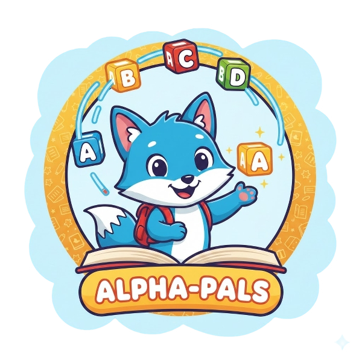

<div align="center">
  
  
  # 📱 Kids Learning - Application Android
  
  Une application Android éducative pour aider les enfants à apprendre les alphabets arabe et français.
</div>

## 🎯 Fonctionnalités

### Alphabet Arabe
- ✅ Affichage complet des 28 lettres arabes
- 🔊 Son associé à chaque lettre
- ✏️ Traçage tactile avec guide visuel
- 🎨 Interface colorée et attrayante

### Alphabet Français
- ✅ Affichage des 26 lettres de A à Z
- 🔊 Prononciation de chaque lettre
- ✏️ Exercice de dessin interactif
- 🧹 Fonction d'effacement et recommencement

### Caractéristiques Techniques
- 📊 Sauvegarde de la progression avec Room Database
- 🎵 Gestion audio avec MediaPlayer
- 🎨 Interface Material Design 3
- 📱 Compatible téléphones et tablettes
- 🌐 Fonctionne 100% hors-ligne

## 🏗️ Architecture

```
app/
├── data/
│   ├── model/           # Modèles de données (Letter, UserProgress)
│   ├── database/        # Room Database (DAO, Entities)
│   └── repository/      # Repository pattern
├── ui/
│   ├── main/           # Écran d'accueil
│   ├── arabic/         # Alphabet arabe
│   ├── french/         # Alphabet français
│   └── drawing/        # Vue de dessin
└── utils/              # Utilitaires (SoundPlayer, DrawingView)
```

## 🔧 Technologies Utilisées

- **Langage**: Kotlin 1.9.10
- **Build System**: Gradle avec Kotlin DSL
- **Base de données**: Room 2.6.1
- **UI**: Material Design 3, ViewBinding
- **Async**: Kotlin Coroutines & Flow
- **Min SDK**: 24 (Android 7.0)
- **Target SDK**: 34 (Android 14)

## 📦 Installation

### Prérequis
- Android Studio Hedgehog ou supérieur
- JDK 17
- Android SDK 34

### Étapes

1. **Cloner ou extraire le projet**
   ```bash
   unzip KidsLearning.zip
   cd KidsLearning
   ```

2. **Ouvrir dans Android Studio**
   - File > Open > Sélectionner le dossier KidsLearning

3. **Synchroniser Gradle**
   - Android Studio va automatiquement télécharger les dépendances
   - Attendre la fin de la synchronisation

4. **Ajouter les fichiers audio (Optionnel)**
   
   Les sons doivent être placés dans:
   ```
   app/src/main/assets/sounds/
   ```
   
   Noms des fichiers attendus:
   - Arabe: `alif.mp3`, `ba.mp3`, `ta.mp3`, etc.
   - Français: `a.mp3`, `b.mp3`, `c.mp3`, etc.

   **Note**: L'application fonctionnera sans les fichiers audio, mais sans sons.

5. **Lancer l'application**
   - Connecter un appareil Android ou démarrer un émulateur
   - Cliquer sur le bouton Run ▶️

## 🎨 Structure du Projet

### Gradle Kotlin DSL
Le projet utilise Kotlin DSL pour Gradle au lieu de Groovy:

**Fichiers principaux:**
- `settings.gradle.kts` - Configuration du projet
- `build.gradle.kts` (root) - Configuration globale
- `app/build.gradle.kts` - Configuration du module app

**Avantages:**
- Auto-complétion dans Android Studio
- Vérification de types à la compilation
- Meilleure intégration avec Kotlin

### Architecture MVVM
- **Model**: Entités Room et modèles de données
- **View**: Activities et layouts XML
- **Repository**: Logique métier et accès aux données

### Base de données Room
Deux tables principales:
1. **letters** - Stocke toutes les lettres
2. **user_progress** - Suit la progression de l'enfant

## 📝 Configuration

### Couleurs personnalisables
Modifier dans `res/values/colors.xml`:
```xml
<color name="primary_blue">#4A90E2</color>
<color name="accent_yellow">#FFD54F</color>
```

### Dimensions
Ajuster dans `res/values/dimens.xml`:
```xml
<dimen name="letter_item_size">80dp</dimen>
<dimen name="stroke_width">12dp</dimen>
```

## 🚀 Prochaines Améliorations

- [ ] Ajouter des animations lors du traçage
- [ ] Système de récompenses et badges
- [ ] Mode multi-joueur
- [ ] Support d'autres langues
- [ ] Reconnaissance d'écriture avec ML Kit
- [ ] Thèmes personnalisables

## 📄 Licence

Ce projet est développé à des fins éducatives.

## 👥 Contribution

Développé dans le cadre du TP08 - Application Kids Learning

## 📧 Support

Pour toute question ou problème:
1. Vérifier que toutes les dépendances sont téléchargées
2. Nettoyer et rebuild: Build > Clean Project puis Build > Rebuild Project
3. Vérifier la version d'Android Studio et du SDK

## 🎓 Notes pour les Développeurs

### ViewBinding
Le projet utilise ViewBinding au lieu de findViewById:
```kotlin
private lateinit var binding: ActivityMainBinding
binding = ActivityMainBinding.inflate(layoutInflater)
setContentView(binding.root)
```

### Coroutines
Gestion asynchrone avec Kotlin Coroutines:
```kotlin
lifecycleScope.launch {
    repository.getFrenchLetters().collectLatest { letters ->
        adapter.submitList(letters)
    }
}
```

### Room Database
Accès fluide aux données avec Flow:
```kotlin
@Query("SELECT * FROM letters WHERE language = :language")
fun getLettersByLanguage(language: LetterLanguage): Flow<List<Letter>>
```

---

**Bonne découverte! 🎉**
